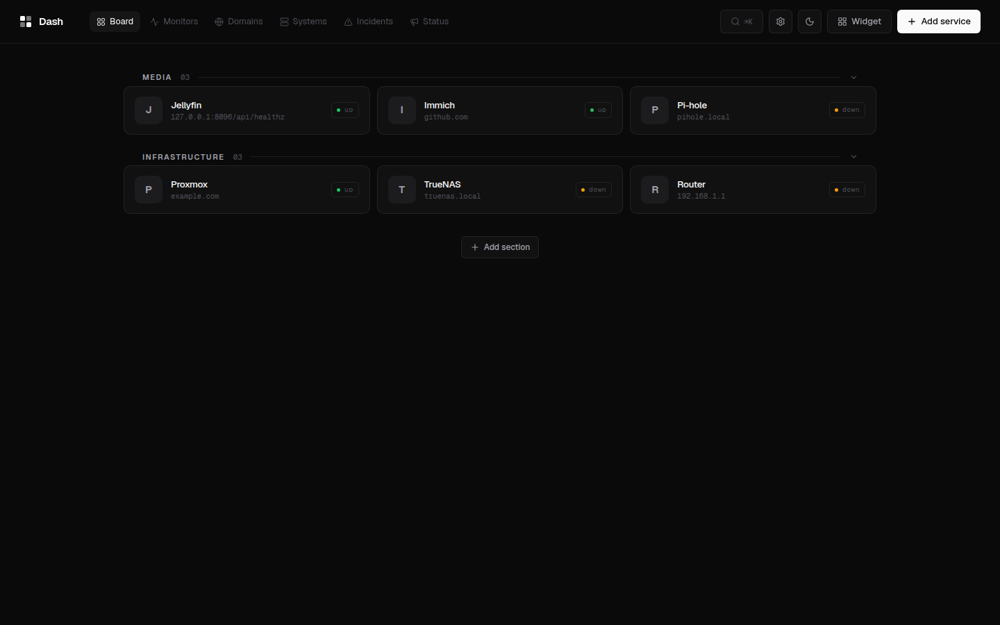
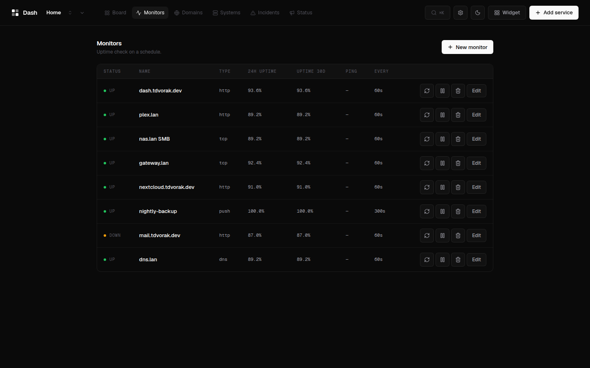
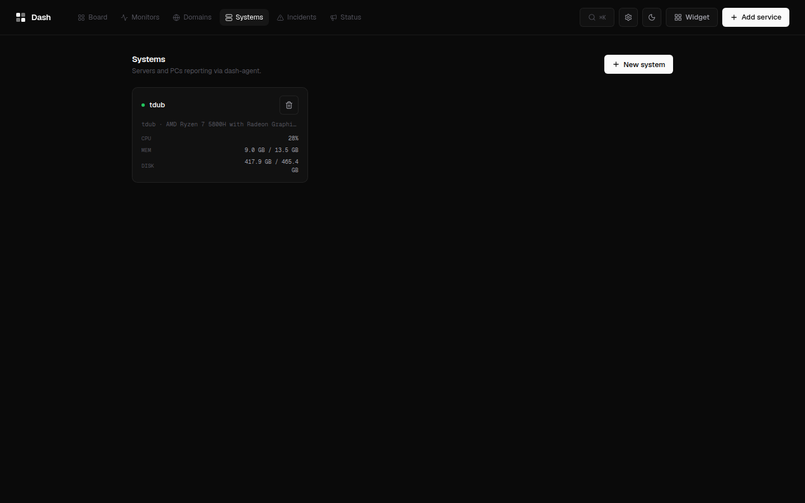
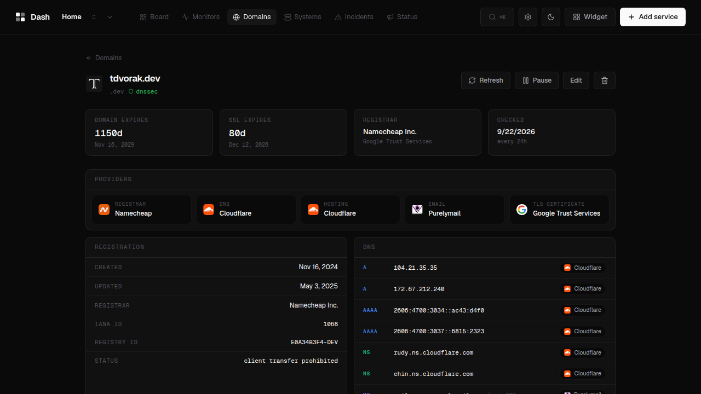
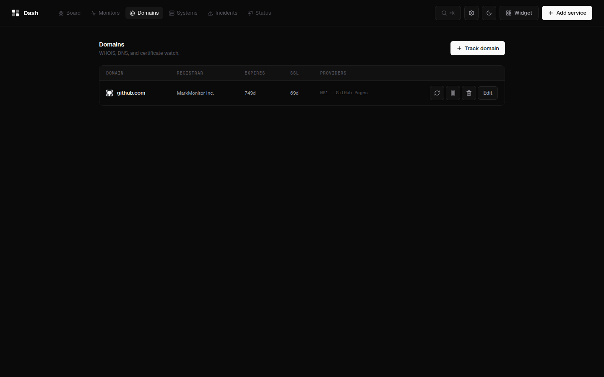
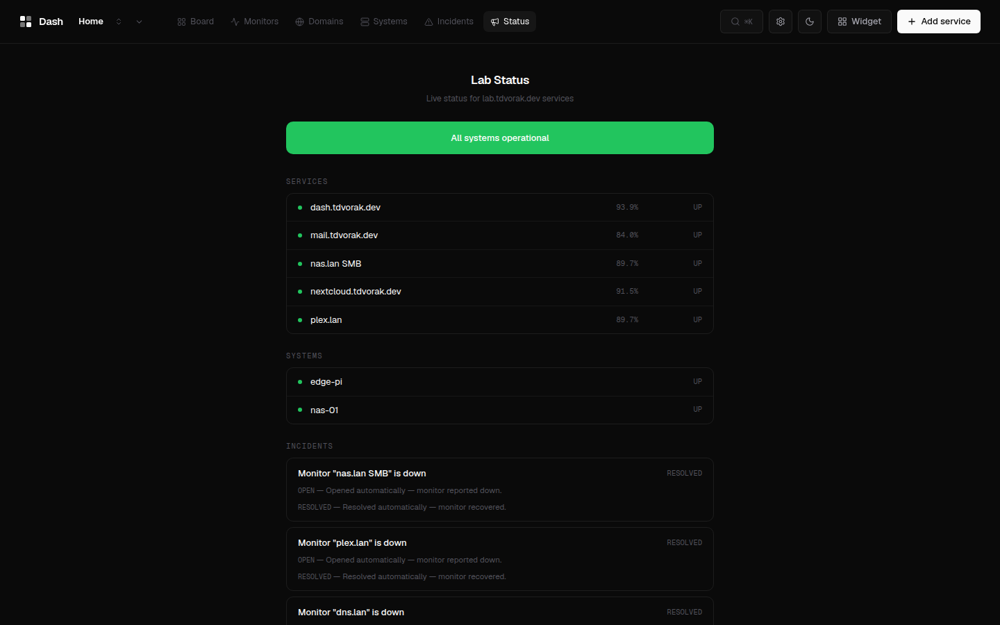

<p align="center">
  
</p>

<h1 align="center">Dash</h1>

<p align="center">
  Self-hosted homelab dashboard.<br>
  Service boards, uptime monitors, domain watch, and system metrics in one container.
</p>

<p align="center">
  <a href="#quick-start">Quick Start</a> ·
  <a href="docs/installation.md">Documentation</a> ·
  <a href="https://github.com/Dvorinka/Dash/releases">Releases</a> ·
  <a href="CONTRIBUTING.md">Contributing</a>
</p>

<p align="center">
  <a href="https://github.com/Dvorinka/Dash/actions/workflows/ci.yml"></a>
  <a href="https://github.com/Dvorinka/Dash/releases"></a>
  <a href="LICENSE"></a>
</p>

## What is Dash?

Dash is a self-hosted homelab dashboard: service boards with drag-and-drop,
uptime monitors, domain intelligence, push-based system metrics, incidents,
and public status pages — one static Go binary serving an embedded React UI.
No YAML, no external database; auth is optional and off by default.

## Screenshots

| Board | Monitors | Systems |
|:-:|:-:|:-:|
|  |  |  |

<details>
<summary>More screenshots</summary>

| Domain intel | Domains | Status page |
|:-:|:-:|:-:|
|  |  |  |

</details>

## Features

- **Service boards** — multiple boards, sections, drag-and-drop, multi-URL services, icon upload, four renderers (Bento, Cards, Index, Console), dark/light themes, custom accent/wallpaper/CSS.
- **Uptime monitors** — HTTP, TCP, ping, DNS, keyword, JSON-path, and push checks on a schedule; heartbeat history, uptime graphs, per-monitor alert rules.
- **Domain watch** — WHOIS/RDAP, TLS certificate, host geolocation, and CT-log subdomain discovery; every DNS record is attributed to its vendor (Cloudflare, Google Workspace, Purelymail, …) with provider badges across registrar, DNS, hosting, email, and CA.
- **System monitoring** — lightweight `dash-agent` pushes CPU, memory, disk, network, load, temperatures, per-container stats, and SMART/ZFS/GPU when available; rendered as stacked per-container charts, per-sensor temperature lines, and load/bandwidth series.
- **Incidents & status pages** — automatic incidents on monitor down, maintenance windows, public `/status/:slug` pages, SVG badges.
- **Alerts** — webhook, Slack, Discord, Telegram, Gotify, ntfy, and SMTP transports.
- **Observability** — Prometheus `/api/metrics`, JSON export, CSV bulk import, importers for Homepage, Homarr, and Dashy configs.
- **Optional auth** — local username/password, bcrypt + SQLite sessions, off by default; public status pages stay open either way.
- **i18n + PWA** — English and Czech UI, installable manifest/service worker.

## Architecture

```
Browser ──▶ dash (single static Go binary)
              ├── Embedded React UI (embed.FS)
              ├── REST API (Gin) ──▶ SQLite
              └── Schedulers ──▶ monitors, domain refresh, alerts, retention
                                    │
                                    ▼ outbound
                        HTTP/TCP/ICMP/DNS, WHOIS/RDAP, TLS, SMTP

dash-agent (one binary per host) ──push JSON──▶ POST /api/systems/ingest
```

## Quick Start

Prerequisites: Docker.

```bash
curl -fsSL https://raw.githubusercontent.com/Dvorinka/Dash/main/install.sh | sh
```

Installs into `./dash` and starts the stack on port 3000. Or from a clone:

```bash
git clone https://github.com/Dvorinka/Dash.git && cd Dash
./scripts/setup.sh          # builds the image and starts the stack
```

Or plain `docker run`, no script needed:

```sh
docker run -d -v ./data:/data -p 3000:3000 ghcr.io/dvorinka/dash:latest
```

Then open `http://localhost:3000` — everything is configured from the UI.
For the system agent, binary installs, reverse proxies, and upgrades see
[docs/installation.md](docs/installation.md).

## Configuration

Dash is configured from the UI; the server reads three environment
variables (`DASH_PORT`, `DASH_DATA_DIR`, `DASH_DEV`). All state lives in one
directory — a SQLite database plus uploaded icons. See
[docs/configuration.md](docs/configuration.md).

## System agent

Monitor a Linux host: create a system in the UI, copy the token, then:

```sh
dash-agent -url http://dash:3000 -token <token>
```

One static binary, no dependencies. systemd unit and container image covered
in [docs/installation.md](docs/installation.md#dash-agent-system-monitoring).

## Documentation

- [docs/installation.md](docs/installation.md) — Docker, binary, agent, reverse proxy, upgrades
- [docs/configuration.md](docs/configuration.md) — env vars, notifications, auth, boards, operations
- [docs/widgets.md](docs/widgets.md) — widget development guide
- `openapi.yaml` — API contract (generated TS client in `packages/api-client`)
- [ROADMAP.md](ROADMAP.md) — design decisions and release history

## Develop

Requires Go 1.24+ and Node 20+.

```sh
npm install            # workspaces: frontend + api-client
npm run dev            # vite dev on :5173, proxies /api to :8080
```

```sh
cd apps/backend
DASH_DEV=1 go run ./cmd/dash   # API on :8080 (DASH_DEV skips embedded UI)
```

## Contributing

See [CONTRIBUTING.md](CONTRIBUTING.md) for the development workflow.

## Security

See [SECURITY.md](SECURITY.md) for reporting vulnerabilities.

## License

[MIT](LICENSE)
